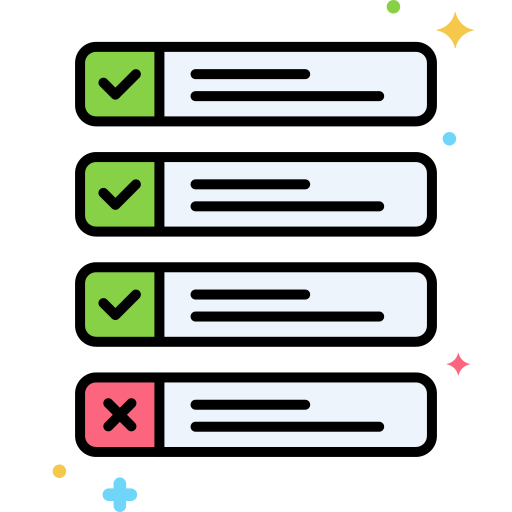

<h1> Hola! Soy Santiago. </h1>

<h2>  Sobre 𝗺í </h2>

<li> 💻 Soy un 𝖥𝗋𝗈𝗇𝗍 𝖤𝗇𝖽 𝖣𝖾𝗏𝖾𝗅𝗈𝗉𝖾𝗋 </li>
<li> 🧳  Actualmente desarrollo en Back 𝖤𝗇𝖽 𝖣𝖾𝗏𝖾𝗅𝗈𝗉𝖾𝗋 </li>
<li> 🧠 Soy un 𝖼𝗎𝗋𝗋𝖾𝗇𝗍𝗅𝗒 𝗅𝖾𝖺𝗋𝗇𝗂𝗇𝗀 𝖭𝖾𝗑𝗍𝖩𝖲 | NodeJS | SQL</li>
<li> 😍 𝖫𝗈𝖿𝗂 𝖡𝖾𝖺𝗍𝗌 + 𝖢𝗈𝖽𝗂𝗇𝗀 </li>
<li> 😆 Aprendo rapido </li>

 
<h2>Sobre mi</h2>

  Actualmente me desempeño como desarrollador backen en ambiente mainframe z/Series implementando lenguaje cobol, cuento con un expertiz en empresas bancarias. Además tengo experiencia en los paradigmas de programación estructurada y objetos, con fuertes habilidades de análisis para afrontar problemas y soluciones a diferentes escenarios.

 
<h2>𝗟𝗮𝗻𝗴𝘂𝗮𝗴𝗲𝘀 𝗮𝗻𝗱 𝗧𝗼𝗼𝗹𝘀</h2>
<code></code>
<code></code>
<code></code>
<code></code>
<code></code>
<code></code>
<code></code>

 
 

#

  
  𝗚𝗶𝘁𝗵𝘂𝗯 𝗦𝘁𝗮𝘁u𝘀
   
   
  

  <b>Note:</b> Estos lengaujes son una metrica no refleja la experiencia.

 

  

 

## 📘 Mis Proyectos mas Destacados

<!-- Bassed on: Repo info cards - https://github.com/anuraghazra/github-readme-stats -->

  

    
    
  

  
&#8192;

  

    
    
  

&#8192;

&#8192;

  

<h2>
  𝗖𝗼𝗻𝗻𝗲𝗰𝘁 𝗪𝗶𝘁𝗵 𝗠𝗲 📲
</h2>

   
  <a href="https://www.linkedin.com/in/leonardo-yzquierdo-97899983/" target="_blank">
    <code></code>
  </a>
  <a href="mailto: leoyzquierdo@gmail.com" target="_blank">
    <code></code>
  </a>

 

#

<h3>𝗧𝗵𝗮𝗻𝗸𝘀 𝗙𝗼𝗿 𝗩𝗶𝘀𝗶𝘁𝗶𝗻𝗴 ✨</h3>

#

<h4>𝗖𝗿𝗲𝗱𝗶𝘁: <a href="https://github.com/Santiago78op">Santiago78op</a></h4>

𝗟𝗮𝘀𝘁 𝗘𝗱𝗶𝘁𝗲𝗱 𝗢𝗻: 17/04/2024
